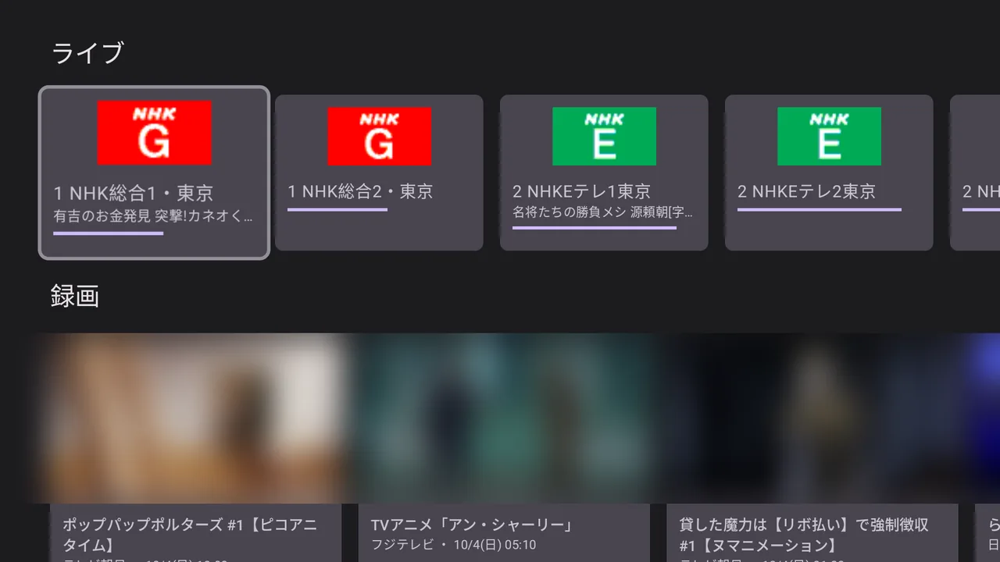
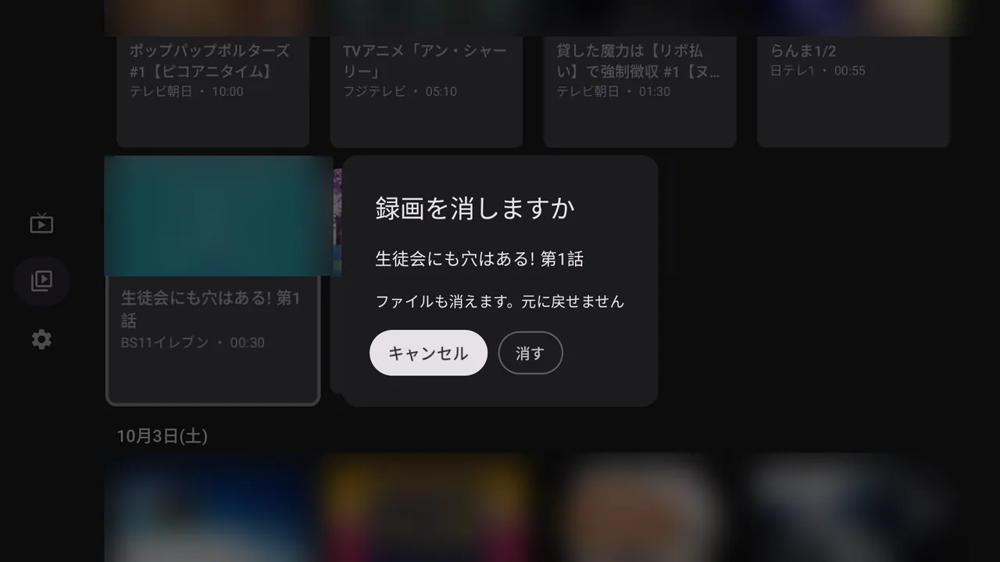

# denpa TV

[denpa](https://github.com/danything/denpa) を Android TV / Google TV で観るアプリです。
Jetpack Compose for TV で書いています。

  

| ホーム | ライブ |
| --- | --- |
|  |  |
| **録画を消す** (長押し) | **設定** |
|  |  |

映像とポスターはぼかしてあります (放送の絵のため)。絵は Android TV のエミュレータ (API 36、1080p) で撮りました。

- **ライブ** — 局の一覧に、いま放送中の番組と進み具合が出ます。選ぶとそのまま観られます。
  上下キー (リモコンのチャンネル送り) で隣の局へ、決定で番組名と残り時間
- **録画** — 新しい順に並び、選ぶと**続きから**再生します。左で 10 秒戻し、右で 30 秒送り、
  決定で止める・動かす、上下 (次へ・前へ) でチャプター送り。**CM は自動で飛ばします** (設定で切れる)。
  観た位置は denpa に預けるので、ブラウザとも続きを分け合えます。録画のカードを**長押しすると消せます**
  (確かめる画面が出て、最初はキャンセルに合っています)

続きの位置といま放送中の番組は、それを返す denpa (danything/denpa#390 を含む版から) で出ます。古い denpa でも、
出ないだけでほかは動きます。

## 入れ方

リリース前なので、CI が焼いた APK を手で入れます (サイドロード)。

1. [Actions](https://github.com/danything/denpa-tv/actions) の最新の成功した実行から、
   `denpa-tv-debug` を落として展開する (`app-debug.apk`)
2. テレビの「開発者向けオプション」で USB デバッグ (またはネットワーク デバッグ) を有効にする
3. `adb connect <テレビの IP>` → `adb install app-debug.apk`

## denpa に繋ぐ

初めて開くと URL を聞かれます。ブラウザで denpa を開いている URL を入れてください
(例: `http://192.168.1.10:3000`。前段の接頭辞の下で動かしているなら、その接頭辞まで)。
繋がるかを確かめてから覚えます。あとから変えるときや、ライブの画質・CM 飛ばしは、
ホームのいちばん下の「設定」から。

**ログインはありません。** テレビが denpa の `TRUSTED_NETWORKS` に入っている (家の LAN から繋ぐ)
前提です。入っていないと一覧が取れません。

## 再生できる形

| 何 | 形 | 選び方 |
| --- | --- | --- |
| ライブ | 低遅延 = 生の TS (MPEG-2)、または fragmented MP4 (H.264 / AV1) | 設定で選ぶ。既定は端末がハードで MPEG-2 を解ければ低遅延、そうでなければ H.264。AV1 はハードで解ける端末だけ選べる |
| 録画 | Matroska (AV1 / H.264)、生の TS (MPEG-2) | 解ける中で軽いものから: AV1 → H.264 → 生の TS |

焼いた録画の字幕 (PGS) は出ます。

### 低遅延 (MPEG-2)

denpa に焼かせず、放送そのもの (1局に絞った TS) を流します (`?codec=raw`)。焼くのを待たないぶん
いちばん早く映り、denpa の CPU も使いません。アプリ側も溜める量を小さくし (0.5〜2 秒、0.25 秒
溜まったら映す)、放送から遅れたら少し速く回して追いつきます。

- **ARIB の字幕は出ません** (焼いたライブ・録画の字幕とは別物で、アプリは読めません)
- **MPEG-2 をハードで解ける端末だけ**選べます。アプリが起動時に端末のデコーダを調べて決めます。
  - Fire TV は公式の仕様に MPEG-2 のハードデコードが載っています
    ([Amazon のデバイス仕様](https://developer.amazon.com/docs/device-specs/device-specifications-fire-tv-streaming-media-player.html))
  - Chromecast with Google TV と Google TV Streamer の公式の仕様には MPEG-2 が載っていません
    ([Google の仕様](https://support.google.com/chromecast/answer/3046409)) — 実機で調べて、無ければ選べません
  - 地デジのチューナーを内蔵したテレビは放送 (MPEG-2) を自分で解くので、持っていることが多いはずですが、
    アプリに使わせるかは機種しだいです。ここも実機で調べます
- **音声は放送の AAC のまま**です。二か国語 (デュアルモノ) の番組は、主と副が左右に分かれて
  同時に聞こえることがあります (アプリでは切り替えられません)。番組の途中で 5.1ch とステレオが
  入れ替わると、一瞬音が途切れることがあります

## できないこと

- **データ放送** と **ライブの字幕** (ARIB) は出ません。ブラウザの denpa を使ってください
- 番組表・予約・ルールはまだありません (観るだけ)
- CM 飛ばしは、denpa が CM の区切りをチャプターとして書いて焼いた録画だけです
  (チャプターは動画そのものから読みます。生の TS にはチャプターがありません)

## 開発

- JDK 17 以上 (CI は 21)、Android SDK (compileSdk 37)
- `./gradlew assembleDebug` / `./gradlew testDebugUnitTest` / `./gradlew lintDebug`
- 使っているライブラリと選んだ理由は [docs/libraries.md](docs/libraries.md)
