# denpa TV

[denpa](https://github.com/danything/denpa) を Android TV / Google TV で観るアプリです。
Jetpack Compose for TV で書いています。

<p align="center">
  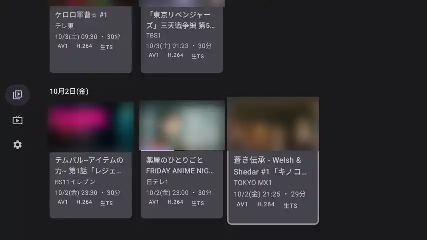
</p>

| 録画 (一番下の古いものから) | **録画の詳しく** (長押し) |
| --- | --- |
| 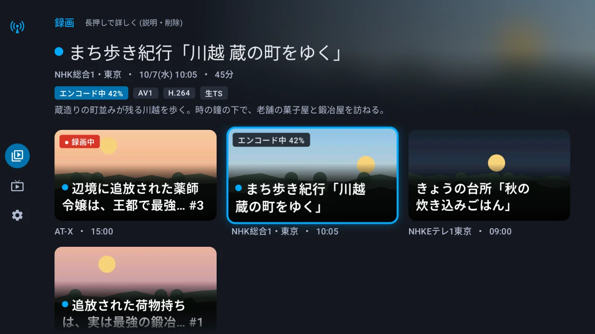 | 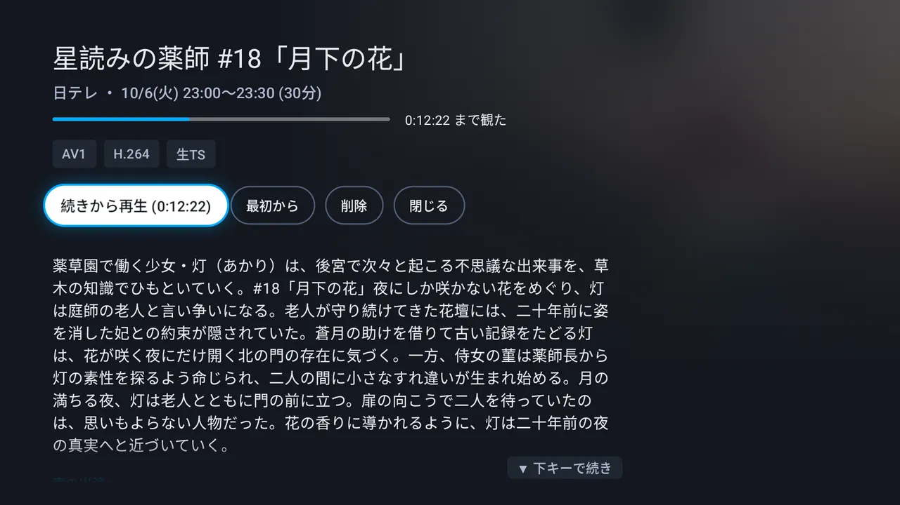 |
| **録画の再生** (下キーでシークバーと操作の列) | **最後まで観たとき** |
| 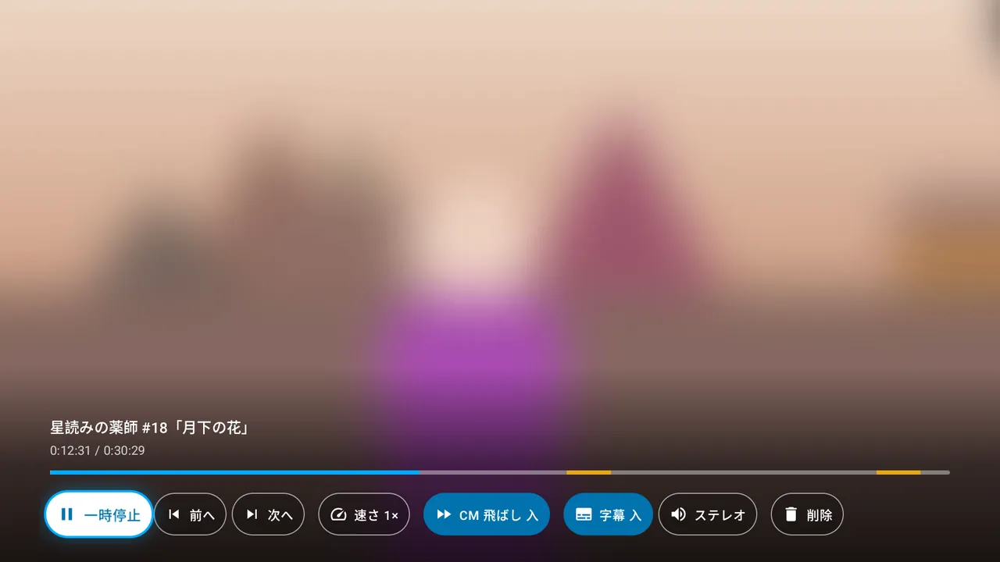 | 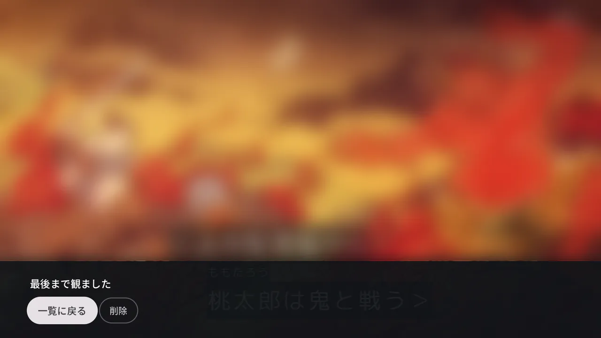 |
| **ライブ** (左右で局送り) | **ライブのメニュー** (下・決定) |
| 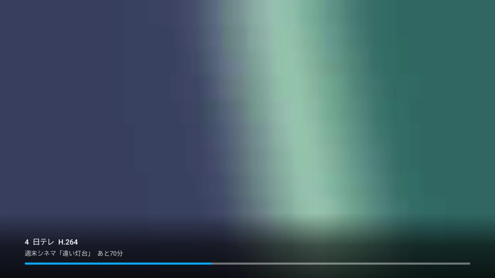 | 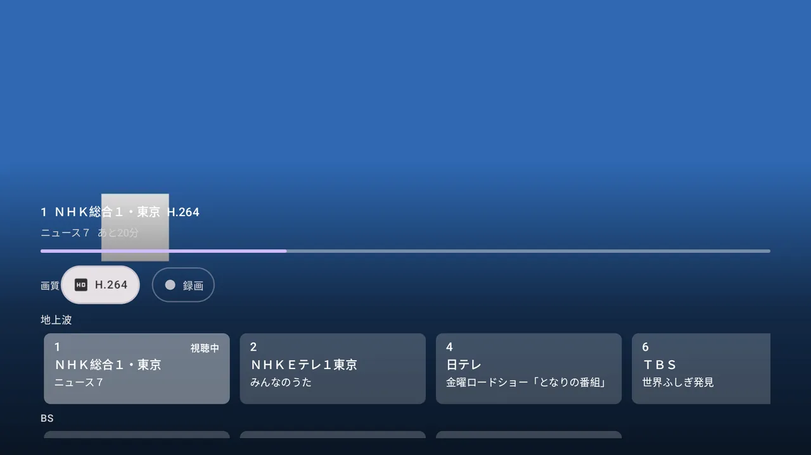 |
| **局の列** (上キー・メニューで下キー) | **局を替えている間** (長くかかったとき) |
| 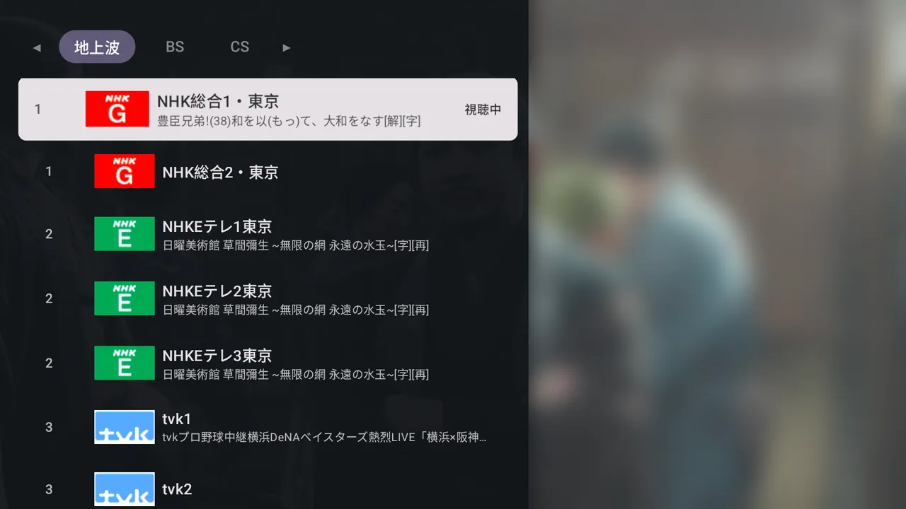 | 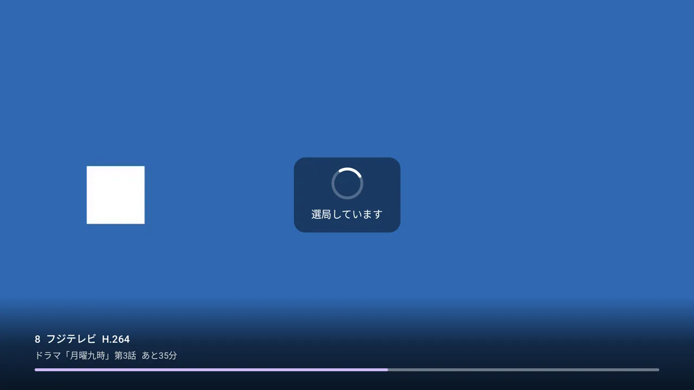 |
| **追っかけ再生** (録画中の録画) | **設定** |
| 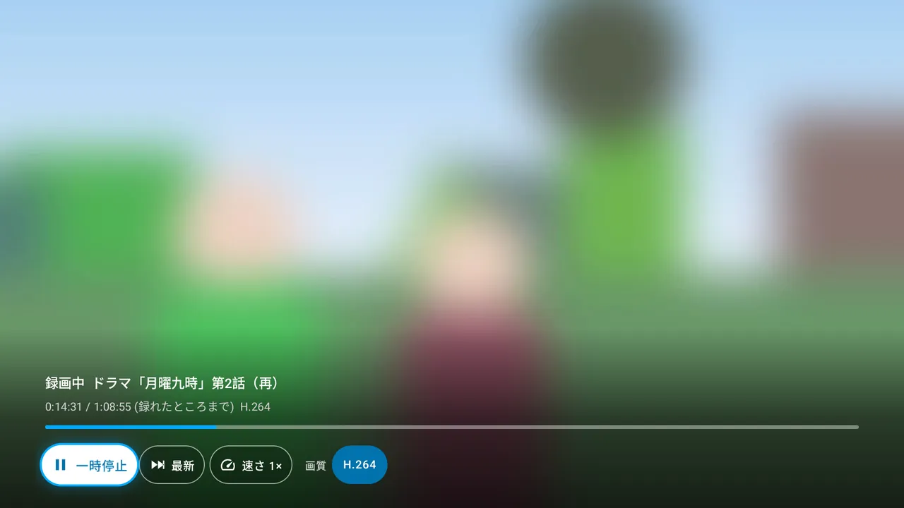 | 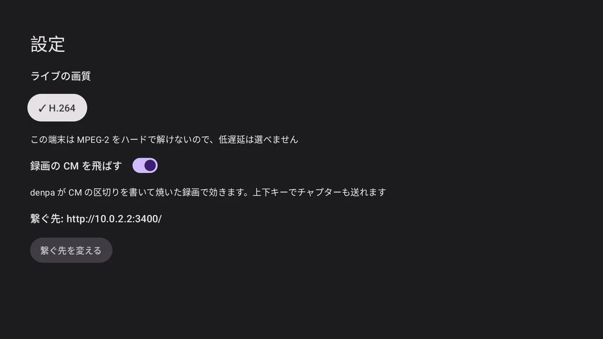 |
| **繋ぐ** | |
| 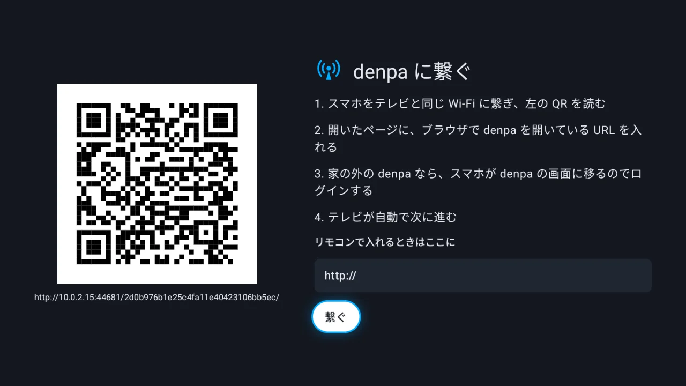 | |

映像とポスターはぼかしてあります (放送の絵のため)。絵は Android TV のエミュレータ (API 36、1080p) で撮りました
(観た割合の帯を見せるため、絵の中の続きの位置は手元で足したものです。追っかけ再生の絵は、録り終えた録画を手元で
「録画中」に見立てて流したものです。いちばん上の動く絵と、ライブのメニュー・局の列・局を替えている間の絵は、
色の映像を流す偽の denpa で撮りました)。

左のメニュー (左キーで開く) から **録画・ライブ・設定** へ行きます。

- **ライブ** — 開くとすぐ、**最後に観ていた局**が映ります (初めてなら局の一覧の先頭)。ブラウザの denpa のライブと同じです。
  - **左右キーで前・次の局へ**。**本放送と同じものを流しているサブチャンネル (NHK総合2、Eテレ2・3 など) は飛ばします**
    (ブラウザと同じく、名前のある番組を放送している局だけ。番組表がまだ空なら全部から)。押すとすぐ行き先の局・番組が出て、
    **キーを離して 0.5 秒たってから替えます** (続けて押す・押し続けると局を送っていき、最後の局だけを映す。途中の局ごとに
    チューナーを替えない)。替えると局・番組・番組の進みが数秒出ます
  - **局を替えている間は前の局の絵のまま**止めておき、1.5 秒たっても映らなければ真ん中に回るものと
    「選局しています」(流れが届きはじめたら「映像を待っています」) を出します。6 秒たっても映らなければ前の絵は暗くします
    (選局に失敗したのに前の局が止まって見えないように)。どれもブラウザの denpa と同じ間合いです
  - **下キー・決定で、下の端にメニュー**が開きます (YouTube・Prime Video・ABEMA などのテレビのアプリと同じく下で開く)。
    上の段が**操作の列**、その下に**局の列**が覗きます。**上キーなら、同じメニューを局の列のいま映している局に合わせて開きます**
    (一覧から局を選ぶ近道)。決定の長押し (情報キーも) では、いまの局と番組を出します
    - 操作の列: **画質 (コーデック)** (H.264 / AV1 / MPEG-2 のうち、このテレビで解けるもの。ブラウザの画質のメニューと同じ)、
      **字幕**・**音声** (あれば)、**録画**。画質はすぐ切り替わり、テレビごとに覚えます。既定は MPEG-2 をハードで解ければ MPEG-2
      (いちばん遅れが少ない)、そうでなければ H.264
    - **録画** — いま観ている番組を denpa に予約します (ブラウザのライブの録画ボタンと同じ。始まっている番組は数秒で録りはじめ、
      何度押しても二重には録りません)。録っている・録る予定の番組は札が「録画中」「録画予約済み」に替わります。
      チューナーが足りないとき (競合) や番組表に無いときは、そう1行出します
    - 局の列: 操作の列から下キーで入る (または上キーで開く) と、いま映している局に合います。**地上波・BS・CS が1列ずつ** (ブラウザのタブにあたる) 縦に並び、
      上下で種別、左右で局を選んで決定で替えます。札には番号・ロゴ・局名・いま放送中の番組と、視聴中・録画中・予約済みの印。
      サブチャンネルは別の番組を流しているときだけ並びます
    - 戻るか、**操作の列 (いちばん上の段) でもう一度上キー**で閉じて映像に戻ります (8 秒触らなければ閉じる)。もう一度の戻るで、いちばん上のメニュー (「ライブ」に合う) へ
  - 観ている局がスキャンのし直しなどで一覧から無くなっても、映しているものは止めません (知らせだけ出ます)
- **録画** — 放送日ごとの見出しで新しい順に格子で並び、開くと**一番下 (いちばん古い録画)** に合っています
  (古いものから片付けられるように。ブラウザの denpa と同じ)。カードには番組名・局・放送日時・長さ・形の札
  (AV1 / H.264 / 生TS) が出て、途中まで観たものはポスターの下に観た割合の帯が出ます。選ぶと**続きから**再生します。
  観た位置は denpa に預けるので、ブラウザとも続きを分け合えます。
  - 再生中は左右で 10 秒戻す・送る (ブラウザと同じ)、決定で止める・動かす。**下キーでシークバーと操作の列**
    (シークバーは左右で 10 秒ずつ、CM は色を変えて出る。もう一度下で操作の列へ)、上キー (か Menu) で操作の列へ直に。**決定の長押しで番組の詳しいところ** (一覧のカードの長押しと同じ。戻るで映像に戻る)。
    帯の中は上下で操作の列とシークバーを行き来し、**シークバー (いちばん上の段) でもう一度上キーを押すと閉じて映像に戻ります** (戻ると同じ)
  - 操作の列: 一時停止 / 再生、前へ・次へ (チャプター送り)、**速さ** (押すたびに 1 / 1.25 / 1.5 / 2 倍。音の高さはそのまま)、
    **CM 飛ばし**、**字幕**・**音声** (あれば)、削除。速さと CM 飛ばしはテレビごとに覚えます (緑のボタンでも速さを1段送れる)
  - **CM 飛ばしは既定で入**。ただしブラウザと同じく、denpa がロゴで CM を判定できなかった録画 (`cmReliable` が false。
    無音だけで当てていて外れやすい) は**切で始まります**。入れたければ操作の列で入れられます (その録画だけ。覚えている設定は変えない)
  - **録画中の録画**はカードに「● 録画中」が付き、選ぶと**追っかけ再生**で観ます (下の「追っかけ再生」)
  - カードを**長押しすると詳しく**: 局・放送日時・長さ・形、番組の説明 (1.32.0 より後の denpa。古い denpa では出ないだけ)、**再生** (続きがあれば「続きから再生」) と**削除**
  - **削除は2回押し** (ブラウザの denpa と同じ): 1回目で「もう一度押すと削除」に変わり、4 秒以内にもう一度押すと消します。
    詳しくの画面では最初は再生に合っています。再生中も操作の列の「削除」で消せて、消すと一覧の隣の録画に戻ります
  - **最後まで観たら**、その位置をすぐ denpa に預け (次に開くと頭から)、「最後まで観ました」と **一覧に戻る** / **削除** を出します (観終えたものは消すことが多いので最初は削除に合っています。2回押しなので1回では消えません)。勝手には戻りません
  - 観て戻ると、開いた録画に合わせ直します
  - アプリを開いている間は denpa の知らせ (`api/events`) を受けて、録画が増えた・焼き上がった・消えたら一覧を、局・番組表が変わったらライブの局を読み直します。焼いている録画のカードには「エンコード中 42%」が出ます

### 字幕と音声

- **字幕** (焼いた録画の PGS など) は操作の列の「字幕 入 / 切」で出し入れします。テレビごとに覚えます (既定は入)。字幕の無い映像では札が出ません
- **生の TS (MPEG-2) の字幕** (ライブ・追っかけ・焼く前の録画) も同じ札で出し入れします。放送の字幕は文字と指定だけなので、
  denpa が描いた絵 (ブラウザの denpa と同じもの) を別の口 (`api/services/<id>/captions`・`api/recordings/<id>/captions`) で受け取り、
  映像の時刻 (放送の PTS) に合わせて重ねます。denpa が「字幕がある」と言った放送だけ札が出ます
- 操作の列・ライブのメニュー・知らせを下に出している間は、**字幕をその上へ持ち上げます** (テレビの YouTube などと同じ。重ならないように)。
  閉じると元の位置に戻ります
- **音声**は2本以上あるときだけ札が出て、押すたびに次の音声へ替わります。名前は denpa が書いた放送の名前
  (「主音声ステレオ」「解説ステレオ」など)、名前が無ければ「音声 2 (日本語)」のように番号と言語。名前の付いた音声を選ぶと覚えて、
  次に同じ名前の音声があればそれで始めます (番号だけの音声は局や番組で意味が違うので覚えません)
- **焼いたライブ・追っかけ** (H.264 / AV1) は、焼いた映像に音声が1本しか入っていないので、札を押すたびに denpa に選んだ音声で
  焼き直してもらいます (`?audio=<id>`。並びは denpa の `audios` そのままで、選んだものはその画面の間だけ)。何も選ばなければ denpa の既定 (主音声) です
- **二か国語 (デュアルモノ)** はブラウザと同じく「主音声」「副音声」「主+副」で選べます (既定は主音声。テレビごとに覚える)。
  生の TS はアプリが選んだ側を両耳へ配り直し、焼いたライブ・追っかけは選んだ側を denpa に頼みます (どちらも denpa が `audios` で
  デュアルモノと知らせる版から)。焼いた録画は denpa が主・副の2本に分けてあります

### 追っかけ再生

録画中の録画は、denpa の追っかけの口 (`api/recordings/<id>/chase`、denpa 1.33.0 以降) で観ます。ブラウザの追っかけと同じく、
続きの位置があればそこから (無ければ頭から)。キーは録画の再生と同じです。

- 焼き方はライブと同じ画質の設定 (MPEG-2 をハードで解ければ生の TS、そうでなければ H.264)。操作の列で替えられます
- 流しっぱなしの1本なので、**位置を変えると頼み直します** (左右・シークバーで 10 秒ずつ。続けて押したぶんはまとめて頼む)。
  シークバーの長さは録れたところまで (いま − 放送の始まり)
- **最新の近くまで来ても勝手には飛ばず、ライブのように観つづけます**。速くして追いかけていたら、追いついたところで等速に戻します。
  操作の列の「最新」で最新の少し手前へ
- 録り終えて最後まで来たら「最後まで観ました」。焼き上がった録画は、一覧に戻ると読み直して、次からはふつうのファイルで観ます
- 速さを変えたとき・長く止めてから動かしたときも、今の位置から頼み直します
- denpa が H.264 / AV1 を焼くのを断ったとき (焼く数の上限など。denpa は空の返事を返す) は、そう出します。少し待つか、画質を替えてください
- 録画中は消せません (消そうとすると「消せませんでした (録画中は消せません)」)

### 操作

十字キーと決定・戻るだけで全部に届きます (Google TV・Fire TV のリモコンには Menu キーもチャンネル送りも無いことが多いので)。
Menu キーやチャンネル送りがあれば、近道として効きます。

| キー | ライブ | 録画の再生・追っかけ再生 |
| --- | --- | --- |
| 左 / 右 | 前 / 次の局 (サブチャンネルは飛ばす。離してから替える) | 10 秒戻す / 送る |
| 下 | メニュー (操作の列と局の列。操作の列に合う) | シークバーと操作の列 |
| 上 | メニュー (局の列の、いま映している局に合う) | 操作の列 |
| 決定 | メニュー | 止める・動かす (止めている間は位置の帯を出したまま) |
| 決定の長押し | 局と番組 (情報と同じ) | 番組の詳しいところ (一覧のカードの長押しと同じ) |
| Menu | メニュー | 操作の列 |
| 戻る | 開いているものを閉じる。何も無ければいちばん上のメニューへ (「ライブ」に合う) | 開いているものを閉じる。何も無ければ一覧へ (開いた録画に合う) |
| チャンネル送り | 前 / 次の局 | — |
| 次へ / 前へ・緑 | — | チャプター送り・速さを1段送る |
| 情報 | 局と番組 | — |

ライブのメニューの中:

| キー | 操作の列 (画質・字幕・音声・録画) | 局の列 (地上波・BS・CS) |
| --- | --- | --- |
| 上 / 下 | 上: メニューを閉じて映像に戻る (戻ると同じ)。下: 局の列へ (いま映している局に合う) | 前 / 次の種別の列。いちばん上の列から上で操作の列へ |
| 左 / 右 | 札を選ぶ | 局を選ぶ |
| 決定 | 押す | その局に替える (メニューは閉じる) |
| 戻る | メニューを閉じる | メニューを閉じる |

- **ライブは左右で局替え、下でメニュー**にしました。YouTube・Prime Video・ABEMA・VLC など、テレビのアプリの多くは下キーでメニューを
  開くので、上下で局を替えると慣れが要ったためです。局と番組の進みは、替えるたびに数秒出るので、メニューを開かなくても分かります。
  決定・Menu でも同じメニューが出て、あとは十字キーで辿れば届きます。決定の長押しは情報キーと同じく、いまの局と番組を出します
  (情報キーの無いリモコンが多いので。長押しを離しても決定にはならず、メニューは開きません)。
  上キーは同じメニューを局の列から開くので、一覧から局を選ぶときはすぐ選べます
- **録画は多くの Android TV のアプリと同じく、下キーでシークバー**。止める・動かすは決定1回、10 秒の戻し・送りは左右1回、
  CM は自動で飛ばすので、ふだんは帯を開かずに済みます
- 帯は下の端に小さく出し (下から薄く暗くするだけで、上と真ん中は空けたまま)、5 秒触らなければ消えます (止めているときは消えません。ライブのメニューは 8 秒)
- 録画を止めると、位置 (いま / 全体) と CM の印のついた帯が出たままになり、どこまで観たか分かります。左右の 10 秒送りもそのまま効きます
- 決定の長押しで開いた詳しくは、決定を離すまで (押し直すまで) 決定を受けません。押し続けた続きで札や「再生」が押されないように
- 開いているメニュー・帯のいちばん上の段 (ライブは操作の列、録画・追っかけはシークバー) で上キーを押すと、閉じて映像に戻ります。
  閉じるのは**その段に合ってから押しはじめた上キー**だけです。局の列や操作の列から上キーを押し続けて上がってきたときは、
  いちばん上の段で止まります (押し続けた勢いで閉じて、映像の上キーでまた開く、とならないように)
- 開いている帯・メニューの中で合わせていた札が消えても (追っかけの「最新」に追いついたなど)、合いは帯の中に戻します
  (どこにも合わずにリモコンが効かなくなることがないように)。戻るキーは、どの Android でも「閉じる・戻る」だけに使います
- **映像を流している間は、スクリーンセーバーを出しません** (止めた・観終えたら出ます)
- **ライブ・追っかけが切れたら、自分で繋ぎ直します** (ブラウザの denpa のライブと同じ)。denpa が流れを閉じた (番組の境目での焼き直し・
  GPU からソフトウェアへ降りた・denpa の再起動)・読めなくなった・**10 秒進まない** (チューナーのドライバが黙った) のどれでも、
  ライブは同じ局を、追っかけは居た場所から頼み直します。待ちは 1 秒から倍々で 10 秒まで、**回数の上限はありません**
  (点けっぱなしで戻ってきたときに映っていてほしい)。その間は前の絵のまま、1.5 秒たったら回るものと「繋ぎ直しています」を出し、
  画面も点けたままにします。局が無い (404) など待っても直らないものは理由を出して止めます。録画のファイルは、回線が切れたときだけ
  いまの位置から 3 回まで読み直します。繋ぎ直すたびに理由を logcat に1行出します (`adb logcat -s denpa:I`。
  `ended` = denpa が閉じた、`stall` = 進まない、`error=…` = 読めない・HTTP の番号。不具合を知らせるときに添えてください)
- **ホームを押す・別のアプリに替えると止めます**。ライブは denpa から降りて (チューナーを空ける) 戻ったら同じ局を映し直し、
  録画は止めて観た位置を預け (「続きを視聴」にも出る)、戻ったら続きから流します。追っかけも観た位置から頼み直します
- 左のメニューは、戻るでも閉じます (右の画面へ戻る)

続きの位置といま放送中の番組は、それを返す denpa (1.30.0 以降) で出ます。ライブの「録画」は、アプリから録る口
(`POST api/services/<id>/record`) を持つ denpa (1.39.0 より後) で効きます (古い denpa では「対応していません」と出るだけ)。録画中の録画 (追っかけ再生) と
CM 飛ばしの既定の判定 (`cmReliable`) は denpa 1.33.0 以降、生の TS の字幕は 1.33.0 より後。古い denpa でも、出ないだけでほかは動きます。

録画を途中で閉じると、テレビのホームの「続きを視聴」に出ます (Android 8.0 以降。観終えた・消した録画は消え、ほかの端末で観た位置にも合わせます。ホームで外したものは、もう一度観るまで出しません)。

### リンクで開く

`denpa://` のリンクで、局や録画を直に開けます (Home Assistant の自動化や adb から)。

| リンク | 開くもの |
| --- | --- |
| `denpa://live` | ライブ (最後に観ていた局。ふつうに開いたときと同じ) |
| `denpa://live/<局>` | その局のライブ。`<局>` は局の id (`GET /api/services` の `id`)・名前・番号 |
| `denpa://recordings` | 録画の一覧 |
| `denpa://recording/<id>` | その録画を観る (続きから。録画中なら追っかけ再生) |

- 局の名前は、そのまま → 全角・半角と大文字・小文字・空白を揃えて → 番号 (リモコン番号、BS/CS は3桁) → 名前の頭、の順に探します。
  放送の局名は「ＮＨＫ総合１・東京」のように来ますが、`NHK総合`・`1` でも当たります。名前は % で符号化しても構いません
- 局・録画が見つからなければ、ライブ・録画の一覧をふつうに開いて、1行知らせます
- 観ている途中に来たら、いまの再生の画面と入れ替えます (戻るで、ライブならメニュー、録画なら録画の一覧へ)
- まだ denpa に繋いでいなければ、リンクは捨てて繋ぐ画面のままです

Home Assistant の [Android TV Remote](https://www.home-assistant.io/integrations/androidtv_remote/) から:

```yaml
action: media_player.play_media
target: { entity_id: media_player.android_tv }
data: { media_content_type: url, media_content_id: denpa://live/NHK総合 }
```

adb から:

```sh
adb shell am start -a android.intent.action.VIEW -d denpa://recording/12
```

## 入れ方

Play ストアにはまだ無いので、パソコンから adb でインストールします。テレビの開発者向けオプションでデバッグを有効にしてから:

```sh
curl -fsSL https://raw.githubusercontent.com/danything/denpa-tv/main/scripts/install.sh | bash -s -- <テレビの IP>
```

Windows、テレビ側の準備、ワイヤレス デバッグのペア設定、うまくいかないときは [docs/install.md](docs/install.md)。

### アップデート

2回目からはアプリの中でアップデートできます (パソコンは要りません)。

アプリを開くと (12 時間に1回まで) GitHub のリリース (プレリリースを含む) を確認し、新しい版があれば裏で APK をダウンロードして
`SHA256SUMS` と照合します。ハッシュが一致しない・`SHA256SUMS` が無いときはインストールしません。
準備ができると、録画の一覧の上に「アップデート (v0.4.0)」が出ます。上キーで選んで押すと、テレビの確認画面が開きます。
インストールが終わるとアプリが閉じるので、開き直してください。

- 初回は「不明なアプリのインストール」の許可画面が開きます。denpa を許可して戻ると、そのまま確認画面に進みます
  (許可画面にいる間にアプリが閉じても、30 分以内に開き直せば続きから)
  アプリから許可が見えないテレビもあるので、一度許可画面を開いたあとは、そのままインストールを試します
  (許可されていなければ、テレビが「このアプリからはインストールできません」と出し、そこから設定を開けます)。
  設定に denpa が2つあれば、両方を許可してください
- Play プロテクトの「ブロックされました」が出たら、「OK」ではなく「インストールする」(INSTALL ANYWAY) を選んでください
- 確認画面が出ないまま 30 秒たつと、押し直せる表示に変わります
- 一度アプリの中でアップデートすると、次からは確認画面なしで入ることがあります (Android 12 以降)
- 裏でダウンロードできなかったときも「アップデート (v0.4.0)」が出ます。押すとダウンロードから始めます (進みは「ダウンロード中 42%」)
- ダウンロードした APK は版ごとにアプリの cache に残し、開き直しても (ハッシュを照合し直して) 使い回します。古い版の APK は消します
- 設定の画面に、いまのバージョンと「アップデートを確認」(すぐ確認) があります
- 開いたときの確認は、GitHub に届かなくても何も出しません。開発版 (`0.0.0-dev`) では確認しません
- `-debug` の付いたリリースは署名が違うので対象外です

## denpa に繋ぐ

初めて開くと、繋ぐ画面に QR コードが出ます。

1. スマホをテレビと同じ Wi-Fi に繋ぎ、QR を読む (テレビの中の小さなページが開く)
2. ブラウザで denpa を開いている URL を入れて送る (例: `http://192.168.1.10:3000/`、`https://denpa.example.jp/`)
   ポートを省くと 80 のあと 3000 も試し、つながったほうを使います
3. **家の LAN の denpa** (テレビが denpa の `TRUSTED_NETWORKS` に入っている) なら、それで終わり。
   スマホに「設定しました」と出て、テレビは録画の画面に進みます
4. **家の外の denpa** (OIDC でログインする構成) なら、スマホが denpa の画面に移ります。ログインすると
   denpa がこのテレビを登録し、テレビは自動で録画の画面に進みます (コードを打ったり見比べたりは要りません。
   QR で開いたページがこのテレビと結び付いていて、コードは URL に入って denpa に届きます)

リモコンで URL を打つこともできます (家の外の denpa なら、テレビに出る QR / URL を別の端末で開いてログイン)。
欄の `http://` のあとに URL をまるごと打っても (`http://https://…`) そのまま使えます。
繋ぐ先を変える・登録を外すのは、左のメニューの「設定」から (設定の画面は繋ぐ先とアプリの版だけ。画質・速さ・CM 飛ばし・字幕・音声は再生の画面の操作の列で、ブラウザの denpa と同じ)。

家の外の denpa への登録には、denpa 側にテレビを登録する口 (`api/device/*`) が要ります
(denpa 1.31.0 以降)。

### 安全のために

- **テレビの中のページは、繋ぐ画面を開いている間だけ**待ち受けます。URL には推測できない文字列が入っていて、
  QR を見ていない同じ LAN の誰かが当てずっぽうで開くことはできません。ページは http (LAN の中だけ) で、
  受け取るのは denpa の URL だけです (パスワードは扱いません。ログインは denpa の画面でします)
- 登録で受け取るトークンは、アプリの領域 (他のアプリから読めない) に置きます。テレビを手放すときは
  「設定」→「サーバーから外す」でトークンを無効にしてください (denpa の画面からも外せます)
- トークンが効かなくなる (外された・期限切れ) と、テレビは繋ぐ画面に戻ります

## 再生できる形

| 何 | 形 | 選び方 |
| --- | --- | --- |
| ライブ | 生の TS (MPEG-2)、または fragmented MP4 (H.264 / AV1) | ライブの操作の列の「画質 (コーデック)」で選ぶ。既定は端末がハードで MPEG-2 を解ければ MPEG-2、そうでなければ H.264。AV1 と MPEG-2 はハードで解ける端末だけ選べる |
| 録画 | Matroska (AV1 / H.264)、生の TS (MPEG-2) | 解ける中で軽いものから: AV1 → H.264 → 生の TS |

焼いた録画の字幕 (PGS) は出ます。

### MPEG-2 (いちばん遅れが少ない)

denpa に焼かせず、放送そのもの (1局に絞った TS) を流します (`?codec=raw`)。焼くのを待たないぶん
いちばん早く映り、denpa の CPU も使いません。アプリ側も溜める量を小さくし (0.5〜2 秒、0.25 秒
溜まったら映す)、放送から遅れたら少し速く回して追いつきます。

- **ARIB の字幕**は、アプリでは解かずに denpa が描いた絵を重ねます ([字幕と音声](#字幕と音声))。denpa が字幕を描き終えるまでの
  間 (選局の直後など) は、出るのが少し遅れることがあります
- **MPEG-2 をハードで解ける端末だけ**選べます。アプリが起動時に端末のデコーダを調べて決めます。
  - Fire TV は公式の仕様に MPEG-2 のハードデコードが載っています
    ([Amazon のデバイス仕様](https://developer.amazon.com/docs/device-specs/device-specifications-fire-tv-streaming-media-player.html))
  - Chromecast with Google TV と Google TV Streamer の公式の仕様には MPEG-2 が載っていません
    ([Google の仕様](https://support.google.com/chromecast/answer/3046409)) — 実機で調べて、無ければ選べません
  - 地デジのチューナーを内蔵したテレビは放送 (MPEG-2) を自分で解くので、持っていることが多いはずですが、
    アプリに使わせるかは機種しだいです。ここも実機で調べます
- **音声は放送の AAC のまま**です (端末のデコーダで解く)。音声が別々に2本ある番組も、二か国語 (デュアルモノ) の主・副も操作の列で替えられます
  ([字幕と音声](#字幕と音声))。番組の途中で 5.1ch とステレオが入れ替わると、一瞬音が途切れることがあります

## できないこと

- **データ放送** は出ません。ブラウザの denpa を使ってください
- 番組表・予約の一覧・ルールはまだありません (録れるのは、ライブで観ている番組の「録画」だけ)
- CM 飛ばしは、denpa が CM の区切りをチャプターとして書いて焼いた録画だけです
  (チャプターは動画そのものから読みます。生の TS にはチャプターがありません)

## 開発

- JDK 17 以上 (CI は 25)、Android SDK (compileSdk 37)
- `./gradlew assembleDebug` / `./gradlew testDebugUnitTest` / `./gradlew lintDebug`
- エミュレータ (か繋いだテレビ) で、縮めた APK を動かして確かめる: `./gradlew :smoke:connectedMinifiedAndroidTest`
  (`smoke/`。偽の denpa を立ててライブと録画を映し、落ちないか・映像が出るかを見る。CI は API 24・28・31・34・36 の
  Android TV のエミュレータで走らせる。CI は APK を1度だけ焼き、各 API では `scripts/smoke-run.sh` で入れて走らせるだけ)。
  端末が何台も繋がっているときは `ANDROID_SERIAL` で1台に絞る
- 使っているライブラリと選んだ理由は [docs/libraries.md](docs/libraries.md)
- リリースの出し方 (署名の鍵) は [docs/release.md](docs/release.md)

## 謝辞

- [@kametani-mikihiro](https://github.com/kametani-mikihiro) — Android TV 12 (BRAVIA) で再生すると落ちるのを、ログ付きで2度報告してくれました (#24)

マージした PR を書いてくれた人はここに載せます。手を入れる前に [CONTRIBUTING](.github/CONTRIBUTING.md) を
見てください。不具合・要望は [Issue](https://github.com/danything/denpa-tv/issues/new/choose) へ。

## ライセンス

[GNU Affero General Public License v3.0](LICENSE) (denpa と同じ)。

`app/src/main/java/io/nayuki/qrcodegen/` は [Project Nayuki の QR Code generator](https://www.nayuki.io/page/qr-code-generator-library) を
取り込んだもので、**MIT License** です (各ファイルの頭の表示のまま)。
