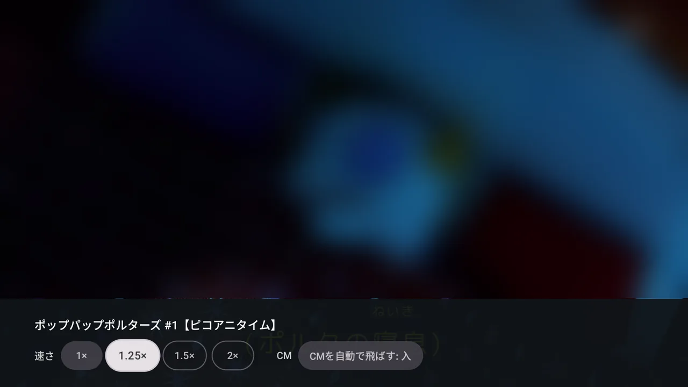

# denpa TV

[denpa](https://github.com/danything/denpa) を Android TV / Google TV で観るアプリです。
Jetpack Compose for TV で書いています。

  

| 録画 | ライブの局の一覧 |
| --- | --- |
|  |  |
| **ライブ** | **録画を消す** (長押し) |
|  |  |
| **ライブのメニュー** (画質) | **録画のメニュー** (速さ・CM 飛ばし) |
|  |  |
| **繋ぐ** | **設定** (繋ぐ先だけ) |
|  |  |

映像とポスターはぼかしてあります (放送の絵のため)。絵は Android TV のエミュレータ (API 36、1080p) で撮りました。

左のメニュー (左キーで開く) から **ライブ・録画・設定** へ行きます。

- **ライブ** — 開くとすぐ、**最後に観ていた局**が映ります (初めてなら局の一覧の先頭)。ブラウザの denpa のライブと同じです。
  - 上下キー / チャンネル送りで隣の局へ
  - 左・決定で**局の一覧**を開く。左右で地上波 / BS / CS を切り替え、番号・ロゴ・局名・いま放送中の番組が並び、
    いま映している局に「視聴中」が付きます。選ぶとその局へ、戻るで閉じます
  - メニューで**画質** (低遅延 MPEG-2 / H.264 / AV1 のうち、このテレビで解けるもの) を選ぶ。すぐ切り替わり、テレビごとに覚えます
  - 情報キーで局と番組名と残り時間
  - 観ている局がスキャンのし直しなどで一覧から無くなっても、映しているものは止めません (知らせだけ出ます)
- **録画** — 放送日ごとの見出しで新しい順に格子で並び、下へ進むと続きを読みます。選ぶと**続きから**再生します。
  左で 10 秒戻し、右で 30 秒送り、決定で止める・動かす、上下 (次へ・前へ) でチャプター送り、
  メニューで**速さ** (1 / 1.25 / 1.5 / 2 倍。音の高さはそのまま) と **CM を自動で飛ばす** (既定で入) を切り替え
  (どちらもテレビごとに覚える。緑のボタンでも速さを1段送れる)。観た位置は denpa に預けるので、ブラウザとも続きを分け合えます。
  カードを**長押しすると消せます** (確かめる画面が出て、最初はキャンセルに合っています)。
  観て戻ると、開いた録画に合わせ直します

続きの位置といま放送中の番組は、それを返す denpa (1.30.0 以降) で出ます。古い denpa でも、
出ないだけでほかは動きます。

## 入れ方

Play ストアにはまだ出していないので、パソコンから adb で入れます。手順は [docs/install.md](docs/install.md)
(APK の手に入れ方、テレビの開発者向けオプション、ワイヤレス デバッグ、困ったとき)。

## denpa に繋ぐ

初めて開くと、繋ぐ画面に QR コードが出ます。

1. スマホをテレビと同じ Wi-Fi に繋ぎ、QR を読む (テレビの中の小さなページが開く)
2. ブラウザで denpa を開いている URL を入れて送る (例: `http://192.168.1.10:3000/`、`https://denpa.example.jp/`)
3. **家の LAN の denpa** (テレビが denpa の `TRUSTED_NETWORKS` に入っている) なら、それで終わり。
   スマホに「設定しました」と出て、テレビは録画の画面に進みます
4. **家の外の denpa** (OIDC でログインする構成) なら、スマホが denpa の画面に移ります。ログインすると
   denpa がこのテレビを登録し、テレビは自動で録画の画面に進みます。テレビとスマホに同じコード (`ABCD-EFGH`) が
   出るので、見比べてください

リモコンで URL を打つこともできます (家の外の denpa なら、テレビに出る QR / URL を別の端末で開いてログイン)。
繋ぐ先を変える・登録を外すのは、左のメニューの「設定」から (設定の画面は繋ぐ先だけ。画質・速さ・CM 飛ばしは再生の画面のメニューで、ブラウザの denpa と同じ)。

家の外の denpa への登録には、denpa 側にテレビを登録する口 (`api/device/*`) が要ります
(denpa 1.31.0 以降)。

### 安全のために

- **テレビの中のページは、繋ぐ画面を開いている間だけ**待ち受けます。URL には推測できない文字列が入っていて、
  QR を見ていない同じ LAN の誰かが当てずっぽうで開くことはできません。ページは http (LAN の中だけ) で、
  受け取るのは denpa の URL だけです (パスワードは扱いません。ログインは denpa の画面でします)
- 登録で受け取るトークンは、アプリの領域 (他のアプリから読めない) に置きます。テレビを手放すときは
  「設定」→「サーバーから外す」でトークンを無効にしてください (denpa の画面からも外せます)
- トークンが効かなくなる (外された・期限切れ) と、テレビは繋ぐ画面に戻ります

## 再生できる形

| 何 | 形 | 選び方 |
| --- | --- | --- |
| ライブ | 低遅延 = 生の TS (MPEG-2)、または fragmented MP4 (H.264 / AV1) | ライブのメニューで選ぶ。既定は端末がハードで MPEG-2 を解ければ低遅延、そうでなければ H.264。AV1 はハードで解ける端末だけ選べる |
| 録画 | Matroska (AV1 / H.264)、生の TS (MPEG-2) | 解ける中で軽いものから: AV1 → H.264 → 生の TS |

焼いた録画の字幕 (PGS) は出ます。

### 低遅延 (MPEG-2)

denpa に焼かせず、放送そのもの (1局に絞った TS) を流します (`?codec=raw`)。焼くのを待たないぶん
いちばん早く映り、denpa の CPU も使いません。アプリ側も溜める量を小さくし (0.5〜2 秒、0.25 秒
溜まったら映す)、放送から遅れたら少し速く回して追いつきます。

- **ARIB の字幕は出ません** (焼いたライブ・録画の字幕とは別物で、アプリは読めません)
- **MPEG-2 をハードで解ける端末だけ**選べます。アプリが起動時に端末のデコーダを調べて決めます。
  - Fire TV は公式の仕様に MPEG-2 のハードデコードが載っています
    ([Amazon のデバイス仕様](https://developer.amazon.com/docs/device-specs/device-specifications-fire-tv-streaming-media-player.html))
  - Chromecast with Google TV と Google TV Streamer の公式の仕様には MPEG-2 が載っていません
    ([Google の仕様](https://support.google.com/chromecast/answer/3046409)) — 実機で調べて、無ければ選べません
  - 地デジのチューナーを内蔵したテレビは放送 (MPEG-2) を自分で解くので、持っていることが多いはずですが、
    アプリに使わせるかは機種しだいです。ここも実機で調べます
- **音声は放送の AAC のまま**です。二か国語 (デュアルモノ) の番組は、主と副が左右に分かれて
  同時に聞こえることがあります (アプリでは切り替えられません)。番組の途中で 5.1ch とステレオが
  入れ替わると、一瞬音が途切れることがあります

## できないこと

- **データ放送** と **ライブの字幕** (ARIB) は出ません。ブラウザの denpa を使ってください
- 番組表・予約・ルールはまだありません (観るだけ)
- CM 飛ばしは、denpa が CM の区切りをチャプターとして書いて焼いた録画だけです
  (チャプターは動画そのものから読みます。生の TS にはチャプターがありません)

## 開発

- JDK 17 以上 (CI は 25)、Android SDK (compileSdk 37)
- `./gradlew assembleDebug` / `./gradlew testDebugUnitTest` / `./gradlew lintDebug`
- 使っているライブラリと選んだ理由は [docs/libraries.md](docs/libraries.md)
- リリースの出し方 (署名の鍵) は [docs/release.md](docs/release.md)

## ライセンス

[GNU Affero General Public License v3.0](LICENSE) (denpa と同じ)。

`app/src/main/java/io/nayuki/qrcodegen/` は [Project Nayuki の QR Code generator](https://www.nayuki.io/page/qr-code-generator-library) を
取り込んだもので、**MIT License** です (各ファイルの頭の表示のまま)。
