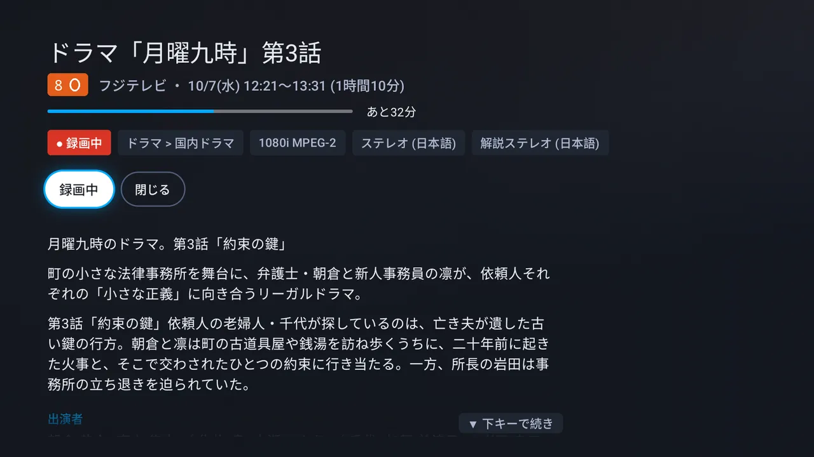
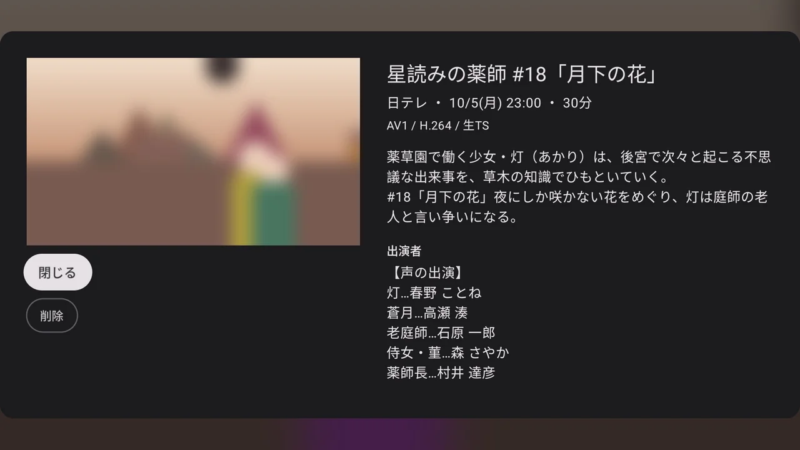

# 使い方

左のメニュー (左キーで開く) から **録画・ライブ・設定** へ行きます。キーの全部は [controls.md](controls.md)。
ブラウザの denpa と同じ決まり・同じ間合いにそろえてあります。
設定の画面は繋ぐ先とアプリの版 (と繋いだ denpa の版) だけで、画質・速さ・CM 飛ばし・字幕・音声は再生の画面の操作の列で替えます。

| **録画の詳しく** (カードの長押し) | **最後まで観たとき** |
| --- | --- |
|  |  |
| **ライブ** (左右で局送り) | **局を替えている間** (長くかかったとき) |
|  |  |
| **ライブの詳しく** (決定の長押し・情報) | **再生中の詳しく** (決定の長押し) |
|  国内ドラマ・1080i MPEG-2・ステレオ (日本語)・解説ステレオ (日本語))、録画中と閉じるの札 (録画中に合っている)。下に1列で、説明と番組内容①②の段落、その下に出演者の見出し" width="420"> |  |
| **追っかけ再生** (録画中の録画) | **設定** |
|  |  |
| **繋ぐ** | |
|  | |

絵は作り物の番組を返す偽の denpa で撮ったものです ([development.md](development.md#画面の絵))。

## ライブ

- 開くと**最後に観ていた局**が映る (初めてなら局の一覧の先頭)
- **左右で前・次の局**。本放送と同じものを流しているサブチャンネル (NHK総合2、Eテレ2・3 など) は飛ばす
  (番組表がまだ空なら全部を回る)。押すとすぐ行き先の局・番組が出て、**キーを離して 0.5 秒たってから替える**
  (続けて押せば途中の局ではチューナーを替えない)。替えると局・番組・番組の進みが数秒出る
- 替えている間は**前の局の絵のまま**。1.5 秒たっても映らなければ回るものと「選局しています」(流れが届けば「映像を待っています」)、
  6 秒たっても映らなければ前の絵を暗くする
- **下キー・決定で下の端にメニュー**。上の段が**操作の列**、その下に**局の列**。上キーなら同じメニューを局の列のいまの局に合わせて開く。
  8 秒触らなければ閉じる
  - 操作の列: **画質** (H.264 / AV1 / MPEG-2 のうちこのテレビで解けるもの。すぐ替わり、テレビごとに覚える。既定は MPEG-2 をハードで解ければ MPEG-2、
    でなければ H.264)、**字幕**・**音声** (あれば)、**録画**
  - **録画**: いま観ている番組を denpa に予約する (始まっている番組は数秒で録りはじめる。二重には録らない)。
    録っている・録る予定なら札が「録画中」「録画予約済み」。録れないとき (チューナーの競合など)・番組表に無いときは1行出す
  - 局の列: **地上波・BS・CS (あれば SKY) が1列ずつ**縦に並ぶ。札は番号・ロゴ・局名・いまの番組と、視聴中・録画中・予約済みの印。
    サブチャンネルは別の番組を流しているときだけ並ぶ
- **決定の長押し (情報キーも) で、いま放送中の番組の詳しく**。番組名・局・時間・番組の進みと残り、札 (録画中・予約済み・ジャンル・映像・音声)、
  説明と放送の詳細 (`api/programs/<id>`。番組表から消えた番組では番組名と時間だけ)。札は「録画」と「閉じる」
- 観ている局がスキャンのし直しなどで一覧から消えても、映しているものは止めない (知らせだけ出す)

## 録画

- 放送日ごとの見出しで新しい順に 3 列で並び、開くと**一番下 (いちばん古い録画)** に合う (古いものから片付けられるように)
- カードはポスターと番組名。途中まで観たものは観た割合の帯、まだ観ていないものは番組名の頭に小さな点。
  **合わせた録画は上の段に大きく** (番組名・局・放送日時・長さ・観た割合・形の札 (AV1 / H.264 / 生TS)・説明の頭の1行)、後ろにその絵をぼかして敷く
- 選ぶと**続きから**再生。観た位置は denpa に預けるので、ブラウザとも続きを分け合える。観て戻ると開いた録画に合わせ直す
- 操作の列: 一時停止 / 再生、前へ・次へ (チャプター)、**速さ** (×1 / ×1.25 / ×1.5 / ×2。音の高さはそのまま)、**CM 飛ばし**、
  **字幕**・**音声** (あれば)、削除。速さと CM 飛ばしはテレビごとに覚える
- **CM 飛ばしは既定で入**。ただし denpa がロゴで CM を判定できなかった録画 (`cmReliable` が false) は切で始まる (入れてもその録画だけ)。
  飛ばせるのは denpa が CM の区切りをチャプターに書いて焼いた録画だけ (生の TS にはチャプターが無い)
- **長押しで詳しく**: 番組名・局・放送日時・長さ・観た位置・形 (と音声) の札、説明と放送の詳細。
  札は「続きから再生」(続きが無ければ「再生」)・「最初から」(続きがあるとき)・「削除」・「閉じる」。
  本文は説明と番組内容をまとめた読みもの → 出演者 → 制作・原作・音楽など → おしらせの順で、下キーで入って読み進める。
  ライブ・再生中の詳しくも同じ並び (再生中は「閉じる」が先頭)
- **削除は2回押し**: 1回目で「もう一度押すと削除」、4 秒以内にもう一度で消す。再生中に消すと一覧の隣の録画に戻る
- **最後まで観たら**位置を預け (次は頭から)、「最後まで観ました」と **一覧に戻る** / **削除** (削除に合う。2回押し)。勝手には戻らない
- 録画中の録画は「● 録画中」が付き、選ぶと**追っかけ再生**
- 開いている間は denpa の知らせ (`api/events`) を受け、録画が増えた・焼き上がった・消えたら一覧を、局・番組表が変わったらライブの局を読み直す。
  焼いている録画は「エンコード中 42%」
- 途中で閉じた録画はテレビのホームの「続きを視聴」に出る (Android 8.0 以降。観終えた・消したものは消え、ほかの端末で観た位置にも合わせる。
  ホームで外したものは、もう一度観るまで出さない)

## 追っかけ再生

録画中の録画は `api/recordings/<id>/chase` で観ます。続きの位置があればそこから (無ければ頭から)。キーは録画の再生と同じ。

- 画質はライブと同じ設定 (MPEG-2 をハードで解ければ生の TS、でなければ H.264)。操作の列で替えられる
- 流しっぱなしの1本なので、**位置・速さを変えると今の位置から頼み直す** (続けて押したぶんはまとめる)。長く止めてから動かしたときも同じ。
  シークバーの長さは録れたところまで
- **最新の近くまで来ても飛ばず、ライブのように観つづける**。速くして追いかけていたら、追いついたところで等速に戻す。「最新」で最新の少し手前へ
- 録り終えて最後まで来たら「最後まで観ました」。焼き上がった録画は、一覧に戻ると次からふつうのファイルで観る
- denpa が H.264 / AV1 を焼けなかったときは「映像を送らずに閉じました」。少し待つか、画質を替える
- 録画中は消せない

## 字幕と音声

- **字幕**は操作の列の「字幕 入 / 切」で出し入れ (テレビごとに覚える。既定は入)。字幕の無い映像では札が出ない
- 放送の字幕 (ARIB) は denpa が解いて**置き場所・大きさ・色まで決めた文字の配置**を受け取り、アプリが文字として描く
  (ブラウザの denpa と同じ描き方。縁取り・囲み・下線・点滅・ルビ・外字も)
  - 生の TS (ライブ・追っかけ・焼く前の録画) は `api/services/<id>/captions`・`api/recordings/<id>/captions` で受け取り、放送の PTS に合わせて重ねる
  - 焼いた録画は `api/recordings/<id>/captions.json` をまるごと受け取る
- 字幕と、放送から来た字 (番組名・説明・局名) は **Denpa Font** (BIZ UDゴシックを丸めたもの。ブラウザの denpa と同じ字) で描く。
  番組表の記号 (外字) もテレビと同じく白黒で出る。アプリの札や見出しは端末の字
- 操作の列・メニュー・知らせを下に出している間は、字幕をその上へ持ち上げる
- **音声**は2本以上あるときだけ札が出て、押すたびに次へ。名前は denpa が書いた放送の名前 (「解説ステレオ」など)、
  無ければ「音声 2 (日本語)」。名前の付いた音声を選ぶと覚えて、次に同じ名前があればそれで始める
- 焼いたライブ・追っかけ (H.264 / AV1) は音声が1本なので、選ぶと denpa に焼き直してもらう (`?audio=<id>`。その画面の間だけ)
- **二か国語 (デュアルモノ)** は「主音声」「副音声」「主+副」(既定は主音声。テレビごとに覚える)。
  生の TS はアプリが選んだ側を両耳へ配り、焼いたライブ・追っかけは denpa に頼む。焼いた録画は denpa が2本に分けてある

## リンクで開く

`denpa://` のリンクで局や録画を直に開けます (Home Assistant の自動化や adb から)。

| リンク | 開くもの |
| --- | --- |
| `denpa://live` | ライブ (最後に観ていた局) |
| `denpa://live/<局>` | その局のライブ。`<局>` は局の id (`GET /api/services` の `id`)・名前・番号 |
| `denpa://recordings` | 録画の一覧 |
| `denpa://recording/<id>` | その録画を観る (続きから。録画中なら追っかけ再生) |

- 局の名前は、そのまま → 全角・半角・大文字・小文字・空白を揃えて → 番号 (リモコン番号、BS/CS は3桁) → 名前の頭、の順に探す。
  「ＮＨＫ総合１・東京」は `NHK総合`・`1` でも当たる。% で符号化してもよい
- 見つからなければライブ・録画の一覧をふつうに開いて1行知らせる
- 観ている途中に来たら再生の画面を入れ替える (戻るで、ライブならメニュー、録画なら一覧へ)
- まだ denpa に繋いでいなければ、リンクは捨てて繋ぐ画面のまま

Home Assistant の [Android TV Remote](https://www.home-assistant.io/integrations/androidtv_remote/) から:

```yaml
action: media_player.play_media
target: { entity_id: media_player.android_tv }
data: { media_content_type: url, media_content_id: denpa://live/NHK総合 }
```

adb から:

```sh
adb shell am start -a android.intent.action.VIEW -d denpa://recording/12
```

## できないこと

- **データ放送**は出ない。ブラウザの denpa を使う
- 番組表・予約の一覧・ルールはまだ無い (録れるのは、ライブで観ている番組の「録画」だけ)
